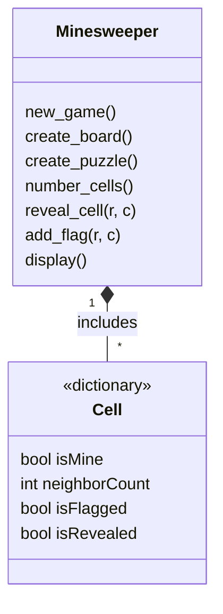
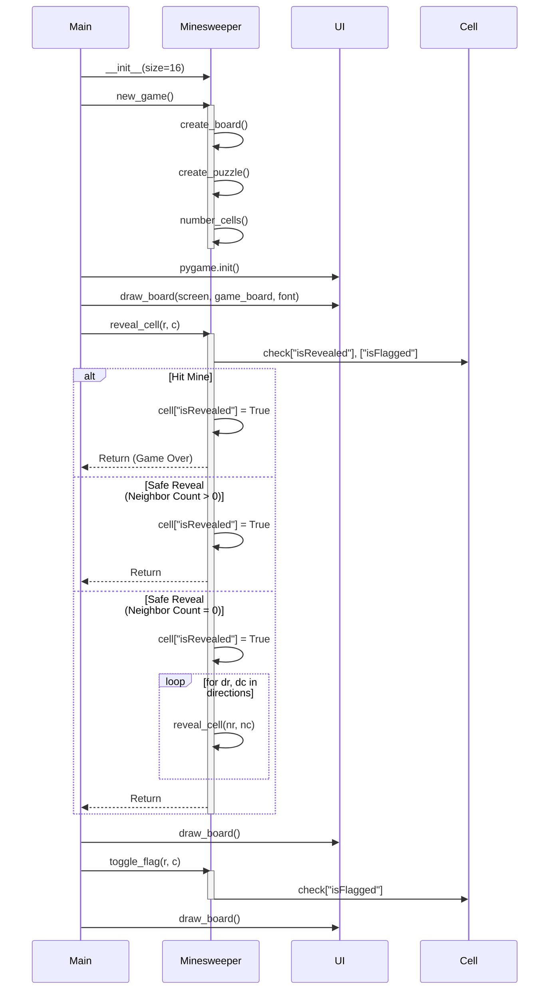

```mermaid
classDiagram

    class Minesweeper {
        new_game()
        create_board()
        create_puzzle()
        number_cells()
        reveal_cell(r, c)
        add_flag(r, c)
        display()
    }

    class Cell {
        <<dictionary>>
        bool isMine
        int neighborCount
        bool isFlagged
        bool isRevealed
    }
    
    Minesweeper "1" *-- "*" Cell : includes

```

```mermaid
sequenceDiagram
    participant Main
    participant Game as Minesweeper 
    participant UI
    participant Cell

%% --- Game Initialization ---
    Main->>Game: __init__(size=16)
    Main->>Game: new_game()
    activate Game
    Game->>Game: create_board()
    Game->>Game: create_puzzle()
    Game->>Game: number_cells()
    deactivate Game
    Main->>UI: pygame.init()
    Main->>UI: draw_board(screen, game_board, font)

    %% --- Player Clicks (Left/Reveal) ---
    Main->>Game: reveal_cell(r, c)
    activate Game
    Game->>Cell: check["isRevealed"], ["isFlagged"]
    alt Hit Mine
        Game->>Game: cell["isRevealed"] = True
        Game-->>Main: Return (Game Over)
    else Safe Reveal (Neighbor Count > 0)
        Game->>Game: cell["isRevealed"] = True
        Game-->>Main: Return
    else Safe Reveal (Neighbor Count = 0)
        Game->>Game: cell["isRevealed"] = True
        loop for dr, dc in directions
            Game->>Game: reveal_cell(nr, nc)
        end
        Game-->>Main: Return
    end
    deactivate Game
    Main->>UI: draw_board()

    %% --- Player Clicks (Right/Flag) ---
    Main->>Game: toggle_flag(r, c)
    activate Game
    Game->>Cell: check["isFlagged"]
    deactivate Game
    Main->>UI: draw_board()

```

