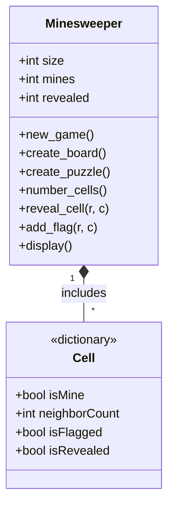

```mermaid
classDiagram

    class Minesweeper {
        +int size
        +int mines
        +int revealed
        
        +new_game()
        +create_board()
        +create_puzzle()
        +number_cells()
        +reveal_cell(r, c)
        +add_flag(r, c)
        +display()
    }

    class Cell {
        <<dictionary>>
        +bool isMine
        +int neighborCount
        +bool isFlagged
        +bool isRevealed
    }
    
    Minesweeper "1" *-- "*" Cell : includes

```
