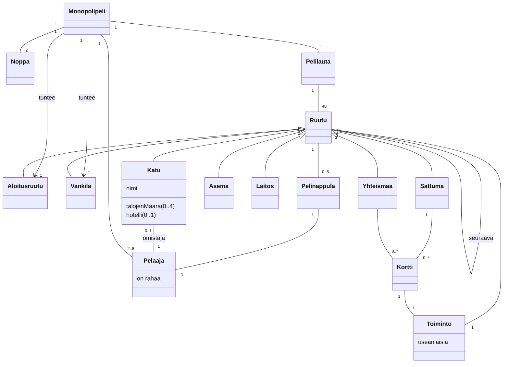

```mermaid
 classDiagram
    %% Pelin perusosat
    Monopolipeli "1" -- "2" Noppa
    Monopolipeli "1" -- "1" Pelilauta
    Pelaaja "2..8" -- "1" Monopolipeli
    Pelaaja : on rahaa

    %% Pelilauta ja ruudut
    Pelilauta "1" -- "40" Ruutu
    Monopolipeli "1" --> "1" Aloitusruutu : tuntee
    Monopolipeli "1" --> "1" Vankila : tuntee

    Ruutu "1" -- "1" Ruutu : seuraava
    Ruutu <|-- Aloitusruutu
    Ruutu <|-- Vankila
    Ruutu <|-- Sattuma
    Ruutu <|-- Yhteismaa
    Ruutu <|-- Asema
    Ruutu <|-- Laitos
    Ruutu <|-- Katu

    %% Toiminnot
    Ruutu "1" -- "1" Toiminto
    Kortti "1" -- "1" Toiminto
    Toiminto : useanlaisia

    %% Kortit sattuma- ja yhteismaa-ruutuihin
    Sattuma "1" -- "0..*" Kortti
    Yhteismaa "1" -- "0..*" Kortti

    %% Pelinappulat ja pelaajat
    Ruutu "1" -- "0..8" Pelinappula
    Pelinappula "1" -- "1" Pelaaja

    %% Normaaleihin katuihin liittyvät tiedot
    Katu : nimi
    Katu : talojenMaara (0..4)
    Katu : hotelli (0..1)
    Katu "0..1" -- "1" Pelaaja : omistaja

```
