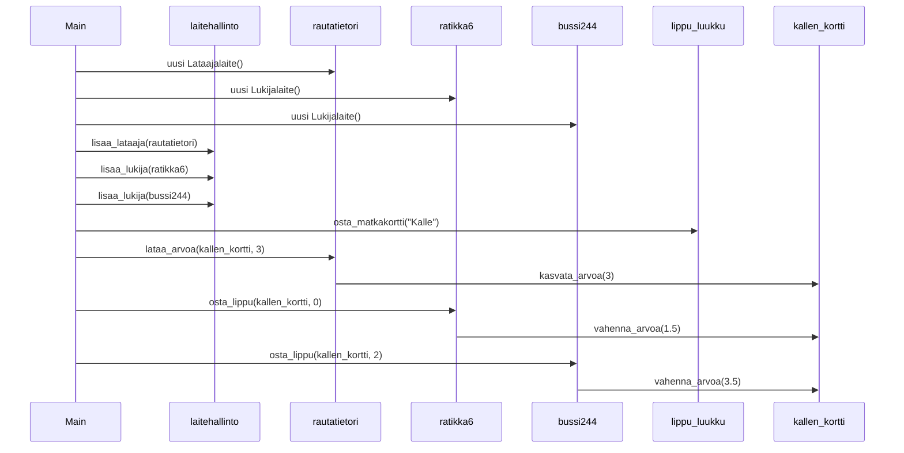

```mermaid
sequenceDiagram

    participant Main
    participant laitehallinto
    participant rautatietori
    participant ratikka6
    participant bussi244
    participant lippu_luukku
    participant kallen_kortti

    Main->>rautatietori: uusi Lataajalaite()
    Main->>ratikka6: uusi Lukijalaite()
    Main->>bussi244: uusi Lukijalaite()

    Main->>laitehallinto: lisaa_lataaja(rautatietori)
    Main->>laitehallinto: lisaa_lukija(ratikka6)
    Main->>laitehallinto: lisaa_lukija(bussi244)

    Main->>lippu_luukku: osta_matkakortti("Kalle")

    Main->>rautatietori: lataa_arvoa(kallen_kortti, 3)
    rautatietori->>kallen_kortti: kasvata_arvoa(3)

    Main->>ratikka6: osta_lippu(kallen_kortti, 0)
    ratikka6->>kallen_kortti: vahenna_arvoa(1.5)

    Main->>bussi244: osta_lippu(kallen_kortti, 2)
    bussi244->>kallen_kortti: vahenna_arvoa(3.5)
```
